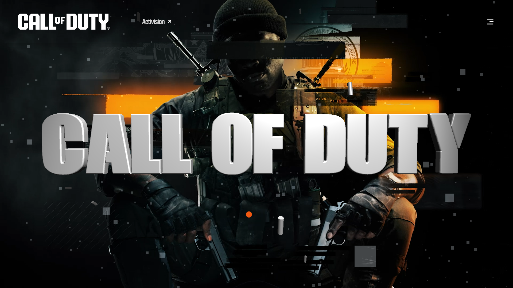
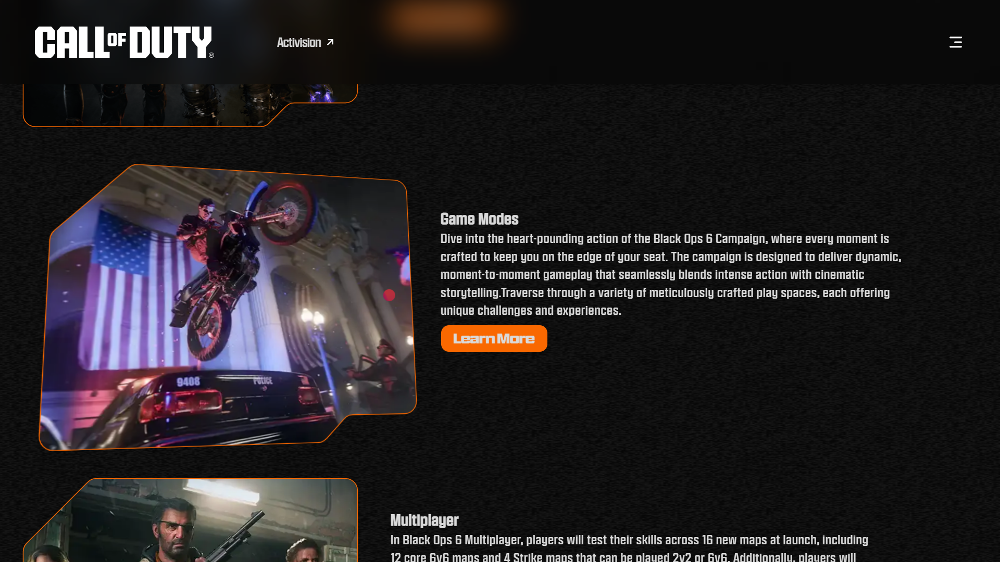
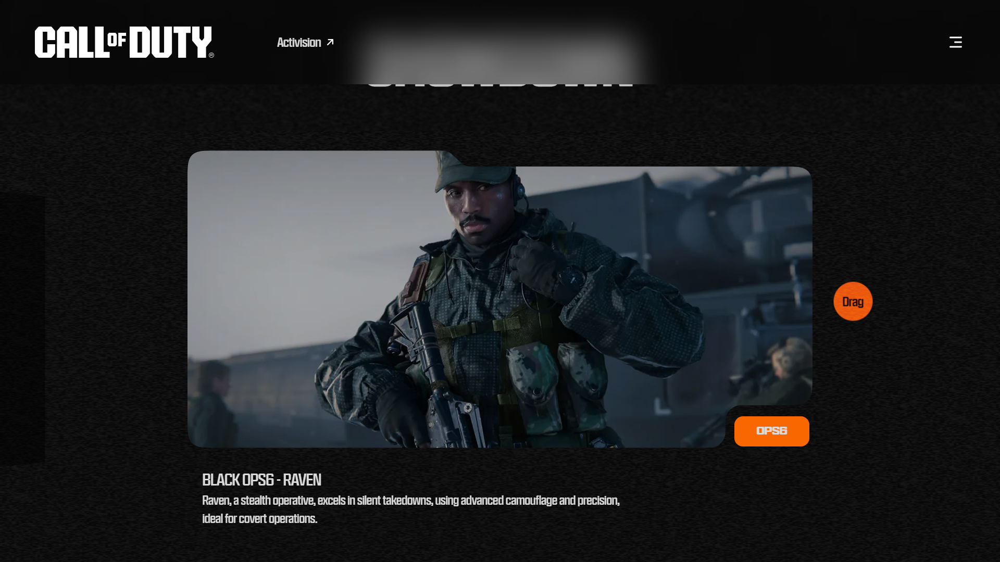
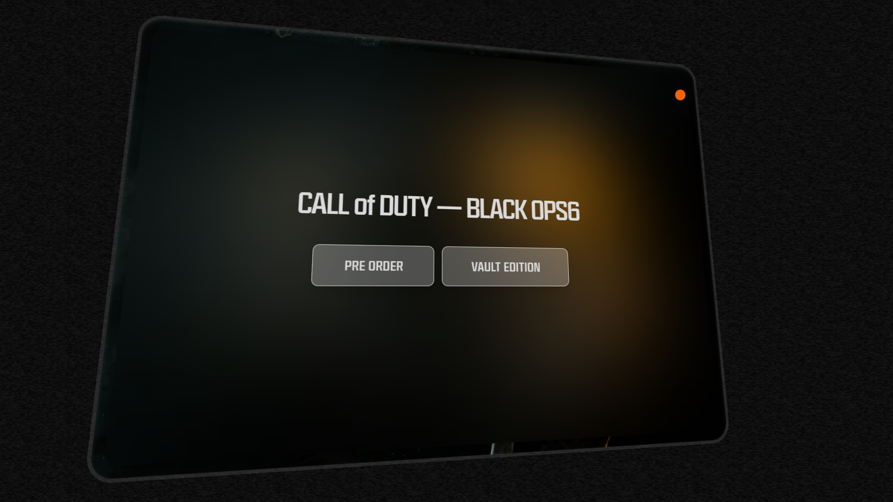

# Call of Duty: Reimagined



A modern, reimagined version of the Call of Duty: Black Ops 6 website, designed and coded by Oliver Felix. This project leverages cutting-edge web technologies to deliver a sleek, responsive, and immersive user experience.

## 🌟 Features

- **Three.js Integration:** Bringing 3D elements to life with smooth animations and interactions.
- **GSAP Animations:** High-performance animations for a dynamic and engaging user experience.
- **Lenis Scroll:** Smooth scrolling for a polished feel across all pages.
- **Lazy Loading:** Optimized content loading for faster page speeds and better performance.
- **Responsive Design:** Seamlessly adapts to all screen sizes, ensuring a great experience on any device.

## 🚀 Technologies Used

- **HTML5 & CSS3**
- **JavaScript (ES6+)**
- **Three.js**
- **GSAP**
- **Lenis**
- **Lazy Loading**
- **Responsive Web Design**

## 📸 Screenshots


*Page with 3D techniques and GSAP animations.*


*Smooth scrolling and lazy loading in action.*


*A call to action showcasing*

## 📂 Installation

To run this project locally:

1. Clone the repository:
    ```bash
    git clone https://github.com/OliverFelixOpcode1453/CallOfDuty-Reimagined.git
    ```
2. Navigate to the project directory:
    ```bash
    cd CallOfDuty-Reimagined
    ```
3. Open `index.html` in your browser.

## 🛠️ Development

If you’d like to contribute or modify the project:

1. Fork the repository.
2. Create a new branch:
    ```bash
    git checkout -b feature/your-feature-name
    ```
3. Make your changes.
4. Commit your changes:
    ```bash
    git commit -m "Add your descriptive commit message here"
    ```
5. Push to your branch:
    ```bash
    git push origin feature/your-feature-name
    ```
6. Open a pull request.

## 📝 License

This project is licensed under the MIT License.
